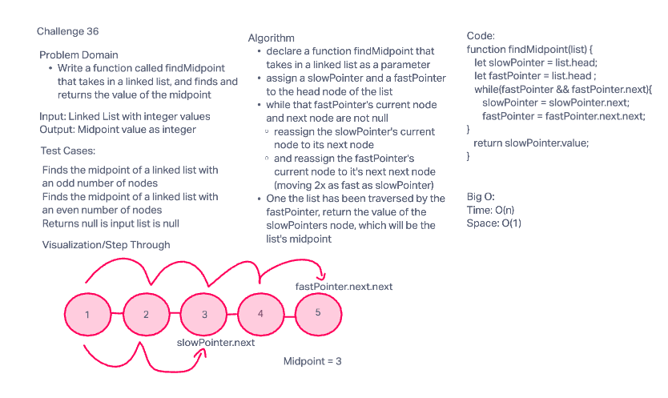
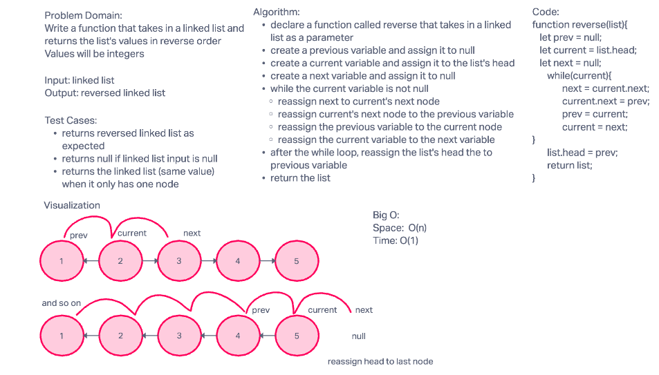

# Common DSA Questions for Practice

1. Linked List
  - findMidpoint function that takes in a list, and finds and returns the value of it's midpoint

- reverse function that takes in a list, reverses it, and returns the list with values in reversed order

