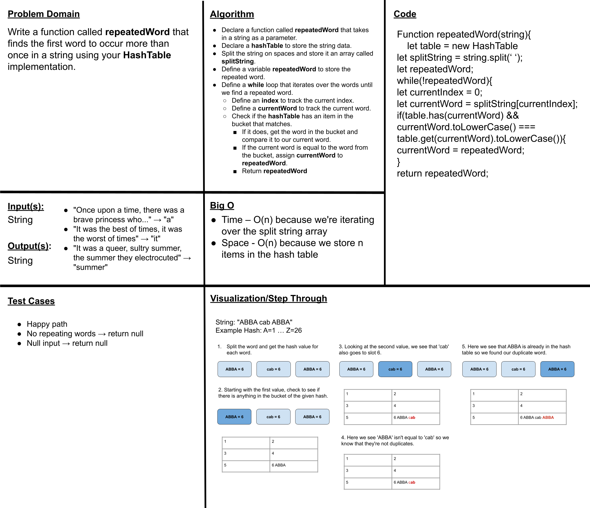
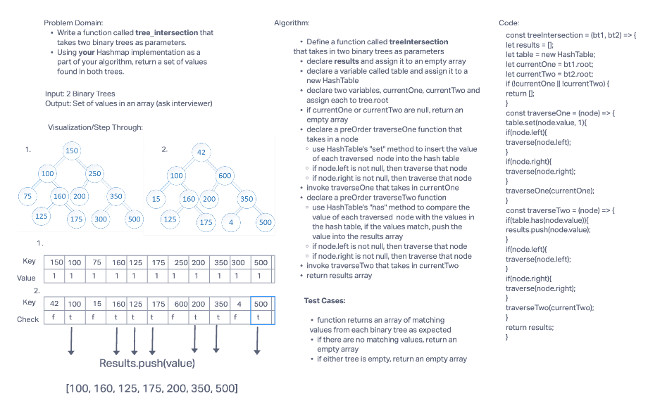

# Hash Table

A hash table, also known as a hash map, is a data structure that maps keys to values. It is one part of a technique called hashing, the other of which is a hash function. A hash function is an algorithm that produces an index of where a value can be found or stored in the hash table.

## Challenge & API

Implement a Hashtable Class with the following methods:

1. set
  - Arguments: key, value
  - Returns: nothing
  - This method should hash the key, and set the key and value pair in the table, handling collisions as needed.
  - Should a given key already exist, replace its value from the value argument given to this method.

2. get
  - Arguments: key
  - Returns: Value associated with that key in the table

3. has
  - Arguments: key
  - Returns: Boolean, indicating if the key exists in the table already.

4. keys
  - Returns: Collection of keys

5.  hash
  - Arguments: key
  - Returns: Index in the collection for that key

6. repeatedWord function implementing HashTable functions
  - Arguments: string
  - Returns: string of the first word in the input string that occurs more than once.

7. treeIntersection function

## Credits and Collaborations
- Partnered with [Kenny Lino]()
- Partnered with [Julian Barker]()
