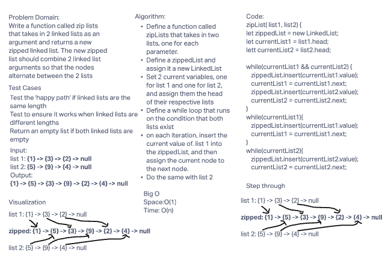

## Singly Linked List Challenge

- Create a linked List class with the following methods:

1. Challenge 5
- [PR](https://github.com/camillarees/data-structures-and-algorithms/pull/18)
- Insert
  - Adds a new node with that value to the head of the list with an O(1) Time performance.
- Includes
  - Indicates whether that value exists as a Node’s value somewhere within the list
- toString
  - Returns a string representing all the values in the Linked List

2. Challenge 6
- Append
  - Adds a new node with the given value to the end of the list
- insertBefore
  - adds a new node with the given new value immediately before the first node that has the value specified
- insertAfter
  - adds a new node with the given new value immediately after the first node that has the value specified

3. Challenge 7
- kthFromEnd
-[PR]()
  - Return the node’s value that is k places from the tail of the linked list

4. Challenge 8
- [PR](https://github.com/camillarees/data-structures-and-algorithms/pull/23)
- zipList
  - Zip two linked lists together into one so that the nodes alternate between the two lists and return a reference to the the zipped list.

## Approach & Efficiency

## Credit and Collaborations
- 401n49 Code Challenge 7 Review
