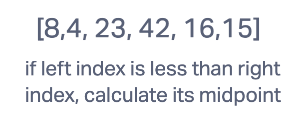
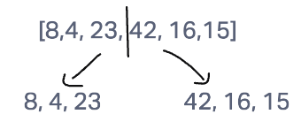
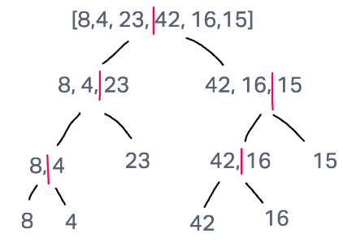
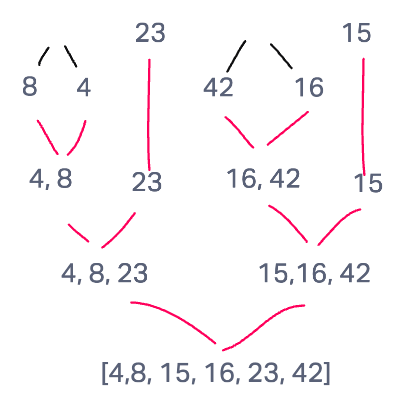

# Blog Notes: Merge Sort

## Merge Sort
The Merge Sort algorithm is a sorting algorithm that is based on the Divide and Conquer paradigm. In this algorithm, the array is initially divided into two equal halves and then they are combined in a sorted manner.

### Source: [Geeks for Geeks](https://www.geeksforgeeks.org/merge-sort/)

## Pseudocode

```
ALGORITHM Mergesort(arr)
    DECLARE n <-- arr.length

    if n > 1
      DECLARE mid <-- n/2
      DECLARE left <-- arr[0...mid]
      DECLARE right <-- arr[mid...n]
      // sort the left side
      Mergesort(left)
      // sort the right side
      Mergesort(right)
      // merge the sorted left and right sides together
      Merge(left, right, arr)

ALGORITHM Merge(left, right, arr)
    DECLARE i <-- 0
    DECLARE j <-- 0
    DECLARE k <-- 0

    while i < left.length && j < right.length
        if left[i] <= right[j]
            arr[k] <-- left[i]
            i <-- i + 1
        else
            arr[k] <-- right[j]
            j <-- j + 1

        k <-- k + 1

    if i = left.length
       set remaining entries in arr to remaining values in right
    else
       set remaining entries in arr to remaining values in left
```

### Sample Array

[8,4,23,42,16,15]

## Step 1



The first step of merge sort is to check if the left index of the array is less than the right index and calculate its midpoint if so.

## Step 2



The next step is to divide the array into two arrays by its midpoint.

## Step 3



This process continues until each value in the array has been separated and compared.

## Step 4



Now, it's time to merge one value with another, sorted from least to greatest. After this, compare the new sorted arrays and continue to merge until the array is sorted and complete.

## Code
```
function mergeSort(array){
  let n = array.length;
  if(n > 1){
    let midpoint = Math.floor(n/2);
    let left = array.slice(0, midpoint);
    let right = array.slice(midpoint);

    mergeSort(left);
    mergeSort(right);

    merge(left, right, array);
  }
  return array;
}

function merge(left, right, array){
  let i = 0, j = 0, k = 0;
  while(i < left.length && j < right.length) {
    if(left[i] <= right[j]) {
      array[k] = left[i];
      i++;
    } else {
      array[k] = right[j];
      j++;
    }
    k++;
  }
  if(i === left.length){
    while(k < array.length) {
      array[k] = right[j];
      j++;
      k++;
    }
  } else {
    while(k < array.length) {
      array[k] = left[i];
      i++;
      k++;
    }
  }
}
```

## Tests
1. Sorts an array of values
2. Sorts an array of values with an odd length
3. Sorts an array with one value
