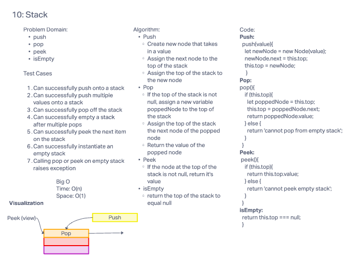
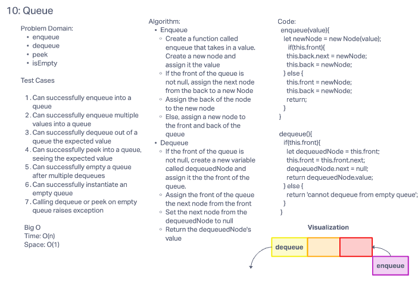

# Stack and Queue

## Challenges, Features, and API

### Stack

  - Create a Stack class that has a top property. It creates an empty Stack when instantiated.
  Methods:
    - push
        -adds a new node with that value to the top of the stack with an O(1) Time performance.
    - pop
      - Removes the node from the top of the stack
      - Should raise exception when called on empty stack
    - peek
      - Returns: Value of the node located at the top of the stack
      - Should raise exception when called on empty stack
    - isEmpty
      - Returns boolean indicating whether or not the stack is empty.

### Queue

  - Create a Queue class that has a front property. It creates an empty Queue when instantiated.
  Methods:
    - enqueue
      - adds a new node with that value to the back of the queue with an O(1) Time performance.
    - dequeue
      - Removes the node from the front of the queue
      - Should raise exception when called on empty queue
    - peek
      - Returns: Value of the node located at the front of the queue
      - Should raise exception when called on empty stack
    - isEmpty
      - Returns q boolean indicating whether or not the queue is empty

