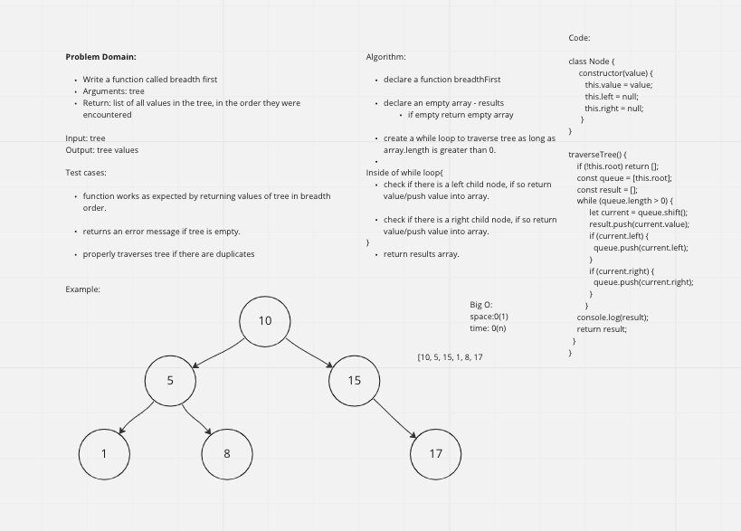
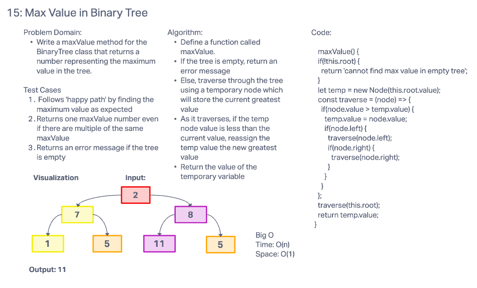

# Trees

## Challenges, Features, and API

### Binary Tree BST Implementation

### Binary Tree
- Create a Binary Tree class
- Depth first traversals:
  - preOrder
  - inOrder
  - portOrder

Each depth first traversal method should return an array of values, ordered appropriately.

- findMax
  - Write a maxValue method for the BinaryTree class that returns a number representing the maximum value in the tree.

- Breadth first traversals:
  - Traverse an input tree using a Breadth-first approach
  - Write a function called breadth first that returns a list of all values in the tree, in the order they were encountered

### Binary Search Tree
- Create a Binary Search Tree class
  - This class should be a sub-class (or your languages equivalent) of the Binary Tree Class, with the following additional methods:
  - Add
    - Adds a new node with that value in the correct location in the binary search tree.
  - Contains
    - Takes in a value and return a boolean indicating whether or not the value is in the tree at least once.

## Credits and Collaborations
Partners: [Jacob Dang](), [Raphael Chookagian ]()
