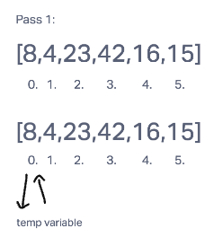
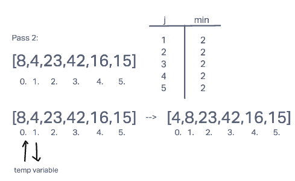
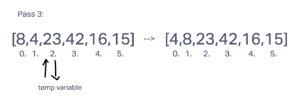
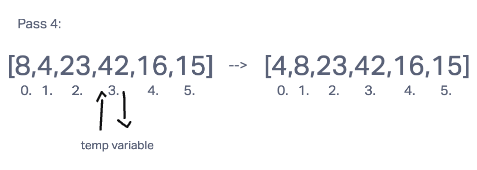
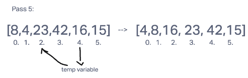
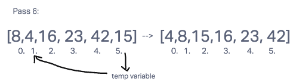

# Blog Notes: Insertion Sort

Insertion sort is a sorting algorithm. An array split into a sorted and an unsorted part, and values from the unsorted part are picked and placed at the correct position in the sorted part.

Source:
[Geeks for Geeks](https://www.geeksforgeeks.org/insertion-sort/)

### Pseudocode

```
  InsertionSort(int[] arr)
    FOR i = 1 to arr.length
      int j <-- i - 1
      int temp <-- arr[i]
      WHILE j >= 0 AND temp < arr[j]
        arr[j + 1] <-- arr[j]
        j <-- j - 1
      arr[j + 1] <-- temp
```

### Sample Array

```
[8,4,23,42,16,15]
```



In the 1st pass of insertion sort, we assign (i) the index 0, and hold the value of the index with a temporary variable. We put the value of the temporary variable into the array position of 0. 8 (the value in the temp variable) is currently the smallest value, so it stays at the front position. The while loop does not occur because j is less than 0.



In the 2nd pass of insertion sort, we assign (i) the index 1, and hold the value of the index with a temporary variable. While the second array's index is greater than or equal to 0, the values at index 0 and 1 are compared. Since 8 is greater than 4, we assign the value of index 1 to the value of index 0. Our j pointer moves to the position before 8, and the temporary value of 4 takes its place.



In the 3rd pass of insertion sort, we assign (i) the index 2 and hold the value of the index with a temporary variable. The value before current index is less than 23 so the while loop does not occur. Nothing changes.



The 4th pass of insertion sorts repeats the same logic as the 3rd pass, only comparing 42 and 23, indexes 2 and 3.



In the 5th pass of insertion sort, we assign (i) the index 4 and hold the value of the index with a temporary variable. We assign j the position before it. Our temporary variable holds the value of the current index of the array, which is 16. While j is greater than or equal to 0 and the temporary variable is less that the array at index j, j (16) is compared to 42 and decremented to compare to 23 after it is determined that 16 < 42. This happens again with 23, and the value of the temporary variable (16) is assigned the previos position of the last shifted value.



In the 6th pass of the insertion sort, we assign (i) the index 4 and hold the value of the index with a temporary variable. The same logic is pass 5 is applied, only with the number 15 in the temporary variable.

### Code

```
function sortInsertion(array){
  for (let i = 0; i < array.length; i++){
    let j = i - 1;
    let temp = array[i];
    while(j >= 0 && temp < array[j]){
      array[j + 1] = array[j];
      j = j - 1;
    }
    array[j + 1] = temp;
  }
  return array;
}
```

### Unit Tests

1. Takes in an array and returns it sorted
2. Accepts an array with one value
3. Returns an empty array if the input array is empty